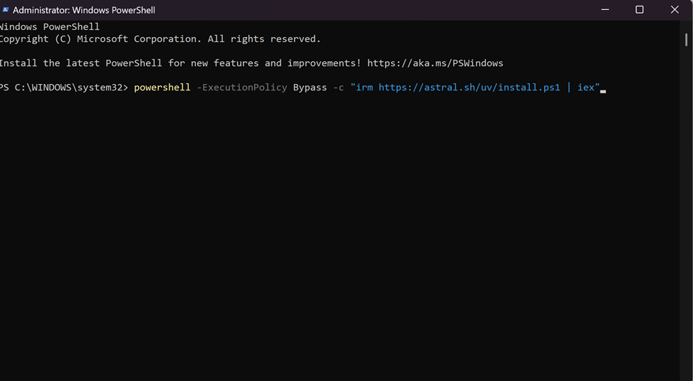
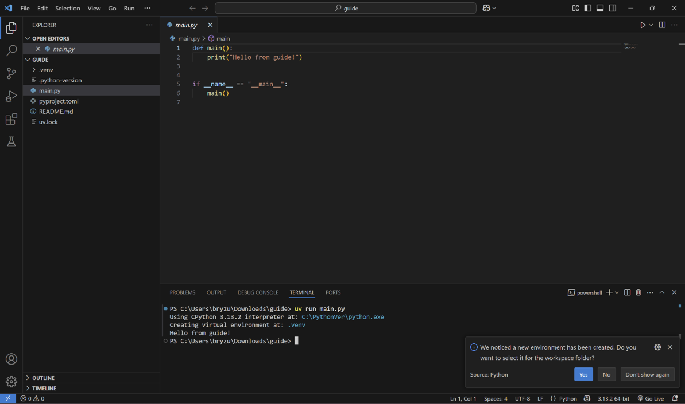

# VIDA Workflow Guide
## Windows Edition

## VS Code Installation

**Step 1:** First, we need to install VS Code: If you already have it installed ----

**Step 2:** First go to https://code.visualstudio.com/

**Step 3:** Click on Download for Windows and the installer will download.

**Step 4:** Double click on the installer in your downloads folder

**Step 5:** The installation wizard will now open. Follow the instructions to install!

**Step 6 (Optional):** There is a section of the installer called "Select Additional Tasks" and there you don't have to change anything but if you wish to I did it like this.


**Step 7:** Congrats, VS Code should now be installed.

## VS Code: Python Setup

**Step 1:** Time to set up Python on VS Code. Firstly, open up VS Code. You will be greeted by a Welcome screen like this. It might not look exactly like this screenshot but don't worry. If you have Python already set up skip to Step 8


**Step 2:** Click on the extensions tab on the left side of the screen.


**Step 3:** This will show you a list of extensions that can be installed. If you ever need one in the future look here. Here you also install languages.


**Step 4:** On the search bar search up Python and click on it. it will open the window for Python. Click on the install button.


**Step 5:** Do the same for Pylance and Python Debugger

**Step 6:** Congrats, Python is now set on VS Code

## UV Astral Package Manager Installation

**Note:** You don't need to go to UV Astral's website to install it, but to look at documentation and other helpful information about uv go to https://docs.astral.sh/uv/. There is information such as commands, troubleshooting and more.

**Step 1:** Install UV like so:

**Step 2:** Open Windows PowerShell on your computer. You can do that by typing "Windows PowerShell" in the search bar on the taskbar of your computer.

**Step 3:** Click on Run as Administrator


**Step 4:** A terminal will appear, and you want to type the following or copy and paste it. Click on the enter and then wait for it to finish the installation process.

```
powershell -ExecutionPolicy ByPass -c "irm https://astral.sh/uv/install.ps1 | iex"
```



**Step 5:** UV should be installed now but to verify simply type `uv` and click enter in the PowerShell and it should look something like this.


## VS Code: Project Startup

**Step 1:** Now that you have set up Python, VS Code and UV it's time to create a new project. First, create a folder somewhere on your computer. (**Note:** Might have just been a personal problem but try **not** to save it to a directory on the cloud)

**Step 7:** Once you have a new folder created, open VS Code. (Note: You could use the walkthroughs visible on the welcome page, if not follow the next steps.) Click on the Explorer tab on the top right corner.


**Step 8:** There it will open a sidebar that says, "Open Folder". It will open a File Explorer tab. Click on it and navigate to the folder you created. Once you find it select it and then click "Select folder"


**Step 9:** Once you open the folder it will look something like this. The name of the folder you opened should appear on the right side.


**Note:** Now time to initialize the project as well as setting up a virtual environment. First let us review the necessary icons on the VS home screen. (Figure 4.4) The icon on the left toggles the sidebar. The sidebar is where you will see the files in your project. The middle icon toggles the terminal at the bottom which is necessary to run the projects and create them. The right-side icon toggles the GitHub Copilot chat.


When the first two icons are toggled on (Figure 4.4) it will display the sidebar and the terminal (Figure 4.4.1)


**Step 13:** Now in the Terminal you want to type in `uv init`. This command will initialize the project and create a couple of files inside the folder. They will appear on the left side of the screen.


**Note:** Let us go over what each file here means. `main.py` is the python file that will run your code. You type in your code there and run it using the terminal (Shown later). `pyproject.toml` documents the dependencies or scripts you will install in the future. The `README.md` is a file that can be edited to describe the project you are working on (a documentation file). You will mainly be using `main.py` plus any other python py file you might create within the folder.

**Step 14:** Try running the main.py which comes with a simple "Hello World" program already there. First click the main.py so it can be opened in the editor. In the terminal where you typed uv init now you want to type `uv run main.py`

**Note:** the format for running with uv in terminal: `uv run *name of py file*.py`

Now that you know how to run the python project you can begin modifying the `main.py` file with the code you want.

But before you do that lets go over the basic uv commands needed.

* `uv run <file name>.py`
  * runs the python file.
  * EX: `uv run main.py`
* `uv add <script/dependency name>`
  * downloads the scripts/dependencies and documents it in pyproject.toml
  * EX: `uv add matplotlib`
  * It can be used to install multiple libraries in one command.
    * EX: `uv add matplotlib num2words numpy`

## Python Virtual Environment Creation:

Now what is a virtual environment and why do I need it? Well, a virtual environment in Python is an isolated space where you can work on your Python projects separately from your system-installed Python. This allows you to set up your own libraries and dependencies without affecting the system Python.

After initializing the project, you might get a notification on VS Code saying "We noticed a new environment has been created. Do you want to select it for the workspace folder?" (Figure 4.6). When that happens, you would click "Yes" and it would allow you to work within the virtual environment.



Normally this only happens during project initiation so in the future you will need to activate it before coding. If VS Code does not automatically create a virtual environment for you can do it yourself with uv. Let's first go over creating the virtual environment on your own with uv.

**Step 1:** Open the Terminal on VS Code and type in `uv venv`


**Step 2:** On the sidebar there should be a new folder named `.venv`. That is the default name for a virtual environment.

**Step 3:** Now as you can see in Figure 5.1 in the terminal you receive a message along with a command on how to activate the virtual environment. Type that command in

**Step 4:** The virtual environment is now activated. At the beginning of the next command line you should see your folder name in parenthesis.


**Note:** There are some errors you might come across when trying to activate your virtual environment. The most common one is the Execution Policy is not set to allow scripts to run. If this is the case, then you will have to allow scripts to run on your computer.

## Streamlit Setup

Streamlit is what is being used for the interface of the projects being created. Streamlit is a Python library that allows for easy app deployment. All you need to do is create the Python code.