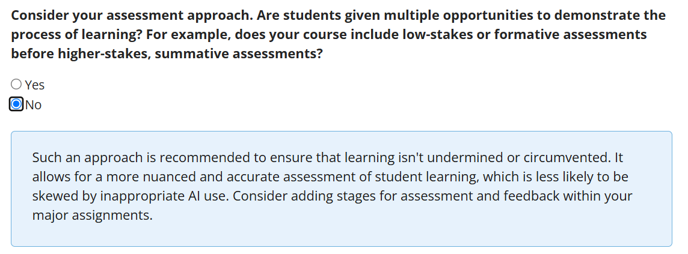
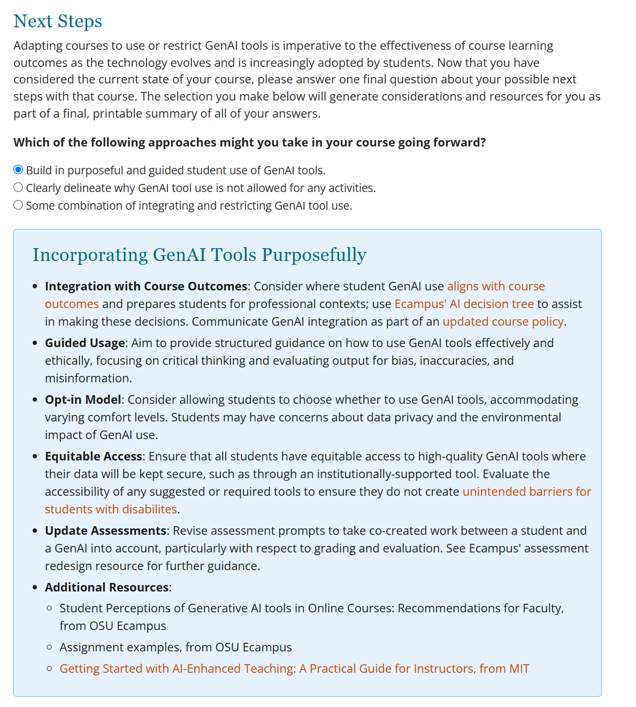

# Quick Evaluation of OSU's Course AI Resilience Tracker (CART) Tool

## Determine if we can reproduce this locally (at RU)

Dena asked us to review the tool and see if we could reproduce it. 

There are a collection of screenshots demonstrating the tool working.

As can be seen from the screenshots, the tool doesn't do any evaluation itself, but simply offers fixed responses to selections made.

### Learning Outcomes

Each checkbox has a response (though the tool can only handle five selections at a time) and that response is shown when you click the "Test Resiliency" button.

So if you select Design, you get the design response, along with anything else selected, as seen in these to examples

### Your Learners

The tool doesn't do anything with this immediately, but does show it to you again in the end (without any line returns) in the summary page.

### Learning Materials

On this page, if you say you're already doing everything, it tells you "Great Job!" otherwise is shows a list of reasons why flexibility of the learning materials matters.

### Activities and Assessments

This page has immediate feedback whenever anything is selected.

Do you state if GenAI is allowed?

Do students have multiple opportunities and low-stakes assessments?

Do you promote academic integrity?

If anything is selected, you get the "on the right path" message, otherwise you get the "be a lot cooler if you did" message.

### Course Policies

Does the syllabus mention a GenAI policy?

Guidance section (might be the most valuable part of this tool) -- for each option selected (up to 3), you get some suggestions. Here's two examples:

Clearly defined ai tools and allowed use:

Share stategies for responsible ai use:

### Next Steps

This page shows three approaches to take in the future - each has a different response:

### Summary

The summary page shows all your answers and the responses. There is a print or save to PDF option which is nice.

There are also some suggested links/resources.
